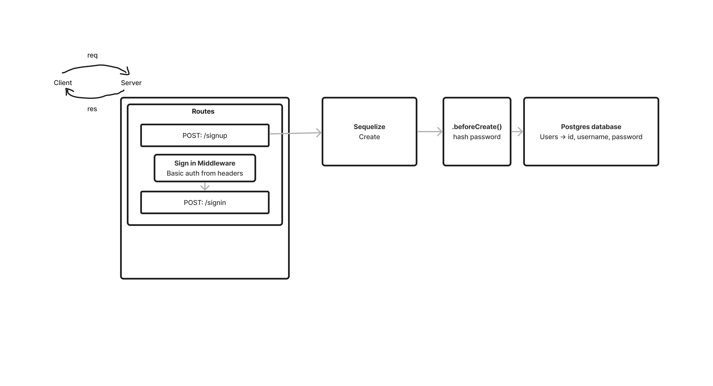

# LAB - Class 6

## Project: Basic Auth

### Author: Jelani Rhinehart

### Problem Domain  

Deploy an Express server that implements Basic Authentication, with signup and signin capabilities, using a Postgres database for storage.

### Links and Resources

- [GitHub Actions ci/cd](https://github.com/Jchips/basic-auth/actions)
- [Pull Request](https://github.com/Jchips/basic-auth/pull/1)

### Setup

#### `.env` requirements

- DATABASE_URL=postgres-database-url

#### How to initialize/run your application

- `nodemon` (if installed) OR
- `npm start`

#### Features / Routes

- What was your key takeaway?

    My key takeaway is how to build a basic authentication server.

- Pull request

    <https://github.com/Jchips/basic-auth/pull/1>

- POST : `/signup` - Sign up a user
- POST : `/signin` - Sign in with a user that already signed in

#### Tests

- How do you run tests?
`npm test`
- Any tests of note?
  - POST to /signup to create a new user.
  - POST to /signin to login as a user (use basic auth).
  - Need tests for auth middleware and the routes.
  - Does the middleware function (send it a basic header).
  - Do the routes assert the requirements (signup/signin).

#### UML

